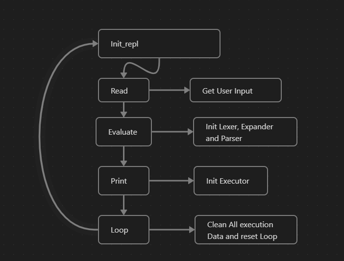
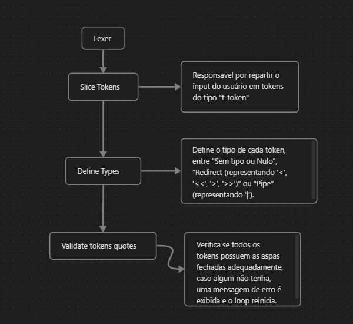
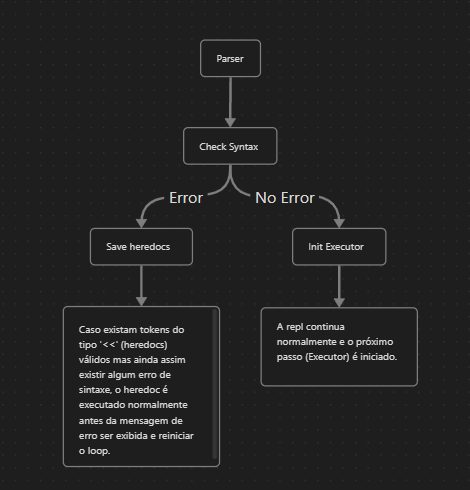
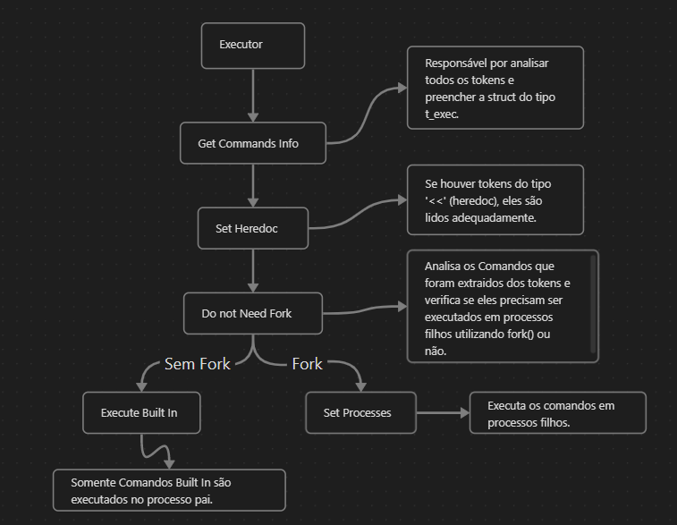

<!-- <h1 align="center"> Minishell </h1> -->

  

# 42_Minishell
Este projeto tem o objetivo de escrever um shell simples utilizando C.

## Índice

1. [Sobre o Projeto](#sobre-o-projeto)
2. [Etapas de produção](#etapas-de-produção)
    1. [Execução REPL](#execução-repl)
    2. [Lexer](#lexer)
    3. [Expander](#expander)
    4. [Parser](#parser)
    5. [Executor](#executor)
3. [Fluxograma](#fluxograma)
4. [Funcionalidades Esperadas](#funcionalidades-esperadas)
5. [Medalha](#medalha)

## Sobre o Projeto

Um shell é uma interface de linha de comando que permite a interação com o sistema operacional. Ele permite a execução de comandos, navegação no sistema de arquivos e automação de tarefas rotineiras. Os shells mais populares incluem o bash (usado no Linux e macOS) e o cmd (usado no Windows). Neste projeto, utilizaremos o bash como base para o desenvolvimento do minishell.

## Dependencias:

* As seguintes bibliotecas:  
<signal.h>  
<stdio.h>  
<readline/readline.h>  
<readline/history.h>  
<sys/types.h>  
<sys/stat.h>  
<dirent.h>  
<fcntl.h>  
<sys/wait.h>  

## Funcionalidades:
- [✔️] Exibição de um prompt quando esperando por um novo comando
- [✔️] Armazenamento do histórico de comandos executados
- [✔️] Manipulação de ctrl + C, ctrl + D e ctrl + \ durante a exibição do prompt.
- [✔️] Manipulação de ctrl + C, ctrl + D e ctrl + \ de acordo com o bash.
- [✔️] Manipulação de aspas simples (') e duplas (").
- [✔️] Manipulação de variáveis de ambiente.
- [✔️] Implementação de redirecionamentos de entrada e saída e uso de pipes
- [✔️] Implementação de comandos internos: echo, cd, pwd, export, unset, env e exit
- [✔️] Procura e inicialização do programa correto a partir de caminhos relativos e absolutos.

## Etapas de produção

Abaixo estão descritas as etapas necessárias para o desenvolvimento do minishell.

### Execuçao REPL

A implementação do comportamento REPL (Read-Eval-Print Loop) é uma etapa crucial no desenvolvimento deste projeto. Ele permite a interação interativa com o usuário, lendo suas entradas, executando as demais etapas e exibindo os resultados em seguida apropriadamente. Ele então volta para o início do loop para ler a próxima entrada, permitindo ao usuário continuar a interagir com o programa.

  

## Lexer

O Lexer é responsavel pelo processamento correto dos comandos digitados pelo usuário. O lexer irá dividir a string de entrada do usuário em palavras-chave (tokens) específicas e mais fáceis de gerenciar. Isso é essencial para garantir que os comandos sejam interpretados corretamente e executados da forma esperada.

  

## Expander

É o responsável por expandir o valor das variáveis de ambiente em cada token, garantindo que o comando final terá o resultado esperado. Também deve tratar as diferenças de comportamento entre aspas simples e aspas duplas.

## Parser

O parser é responsável por analisar a sequência de palavras-chave geradas pelo lexer, verificando se elas seguem a formatação necessária antes de serem passadas para o executor. 

  

## Executor

O Executor é a parte responsável por receber a lista de palavras-chave formatada pelo parser, interpretar e definir a ordem de execução dos comandos. Ele também é responsável por lidar com os redirecionamentos de entrada e saída, garantindo que os dados sejam direcionados corretamente para os comandos. Ele também é responsável por realizar a execução efetiva dos comandos, garantindo que os comandos sejam executados de maneira adequada.

  

## Medalha

